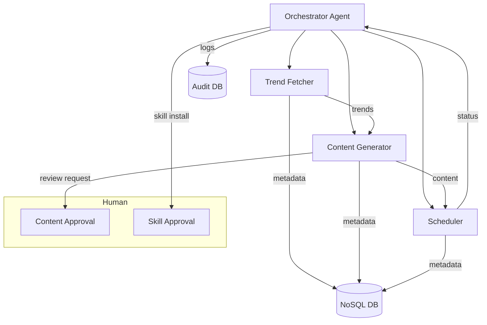

# Architecture Strategy for Project Chimera

## Agent Pattern
Project Chimera adopts a **Hierarchical Swarm** agent pattern:
- **Hierarchical:** A top-level Orchestrator agent delegates tasks to specialized Worker agents (e.g., trend fetcher, content generator, scheduler).
- **Swarm:** Workers can operate in parallel, coordinate via shared state, and dynamically form sub-groups for complex workflows.

**Justification:**
- Enables modularity, scalability, and parallel execution of influencer tasks.
- Supports agent-to-agent collaboration and skill sharing (OpenClaw integration).
- Facilitates robust error handling and fallback strategies.

## Human-in-the-Loop
Human approval is integrated at key safety checkpoints:
- **Content Approval:** Before publishing generated content, a human reviewer can approve, edit, or reject posts.
- **Skill Installation:** New or updated skills require explicit human approval before activation.
- **Audit Logs:** All agent actions are logged and can be reviewed for compliance and safety (MCP Sense integration).

## Database Strategy
For high-velocity video metadata, a **NoSQL** database (e.g., MongoDB, DynamoDB) is preferred:
- **NoSQL Pros:**
	- Handles large volumes of unstructured/semi-structured data efficiently.
	- Scales horizontally for high write throughput (e.g., viral video events).
	- Flexible schema supports evolving metadata fields (e.g., engagement metrics, tags).
- **SQL Pros:**
	- Strong consistency and relational queries for reporting/analytics.
	- Useful for transactional data (e.g., user permissions, audit logs).

**Strategy:**
- Use NoSQL for primary video metadata storage.
- Use SQL for critical relational data and analytics as needed (polyglot persistence).

## Diagrams

---

**Rationale:**
- The hierarchical swarm pattern enables scalable, modular, and resilient agent orchestration.
- Human-in-the-loop checkpoints ensure safety and compliance.
- NoSQL is optimal for high-velocity, flexible video metadata, while SQL supports analytics and governance.
