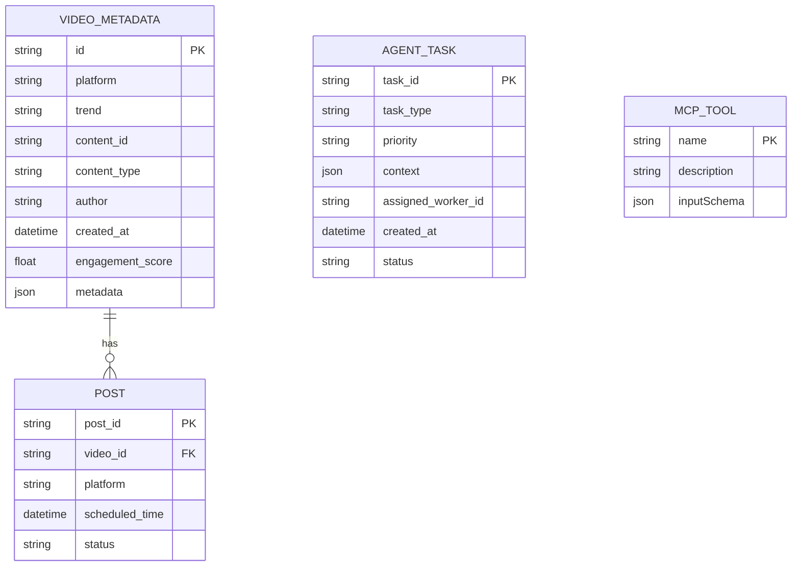

# Technical Specification

## API Contracts

### skill_fetch_trends
**Input:**
```json
{
	"platform": "str",
	"topic": "str"
}
```
**Output:**
```json
{
	"trends": [
		{ "name": "str", "score": "float" }
	]
}
```

### skill_generate_content
**Input:**
```json
{
	"trend": "str",
	"format": "str"
}
```
**Output:**
```json
{
	"content": "str",
	"metadata": { /* additional info */ }
}
```

### skill_schedule_post
**Input:**
```json
{
	"content": "str",
	"platform": "str",
	"time": "datetime"
}
```
**Output:**
```json
{
	"status": "str",
	"post_id": "str"
}
```


## Database Schema



## Interface Requirements

### Agent Task Schema (JSON)
```json
{
	"task_id": "uuid-v4-string",
	"task_type": "generate_content | reply_comment | execute_transaction",
	"priority": "high | medium | low",
	"context": {
		"goal_description": "string",
		"persona_constraints": ["string"],
		"required_resources": ["mcp://twitter/mentions/123", "mcp://memory/recent"]
	},
	"assigned_worker_id": "string",
	"created_at": "timestamp",
	"status": "pending | in_progress | review | complete"
}
```

### MCP Tool Definition (JSON Schema)
```json
{
	"name": "post_content",
	"description": "Publishes text and media to a connected social platform.",
	"inputSchema": {
		"type": "object",
		"properties": {
			"platform": {
				"type": "string", 
				"enum": ["twitter", "instagram", "threads"]
			},
			"text_content": {
				"type": "string",
				"description": "The body of the post/tweet."
			},
			"media_urls": {
				"type": "array", 
				"items": {"type": "string"}
			},
			"disclosure_level": {
				"type": "string",
				"enum": ["automated", "assisted", "none"]
			}
		},
		"required": ["platform", "text_content"]
	}
}
```

## Implementation Roadmap

### Phase 1: Core Swarm
- Establish Planner-Worker-Judge loop and Task Queue infrastructure.
- Use pydantic for strict schemas and redis-py for queuing.

### Phase 2: MCP Integration
- Integrate Model Context Protocol (MCP) for all external data and tool access.
- Implement MCPClient and connect to MCP servers for social, memory, and commerce tools.

### Phase 3: Agentic Commerce
- Integrate Coinbase AgentKit for non-custodial wallet management and on-chain transactions.
- Implement budget governance and anomaly detection via CFO Judge agent.

---

(All API contracts, schemas, and protocol changes must be ratified in this spec before implementation. See also: skills/README.md and openclaw_integration.md for protocol details. For full SRS, see research/architecture_strategy.md.)

(Add detailed schemas and contracts as needed)
